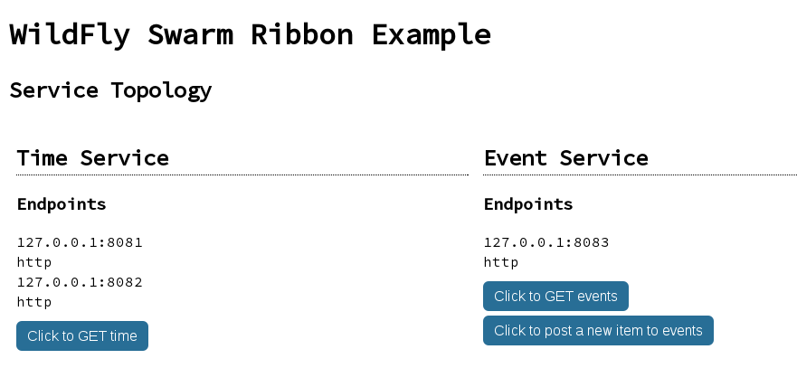
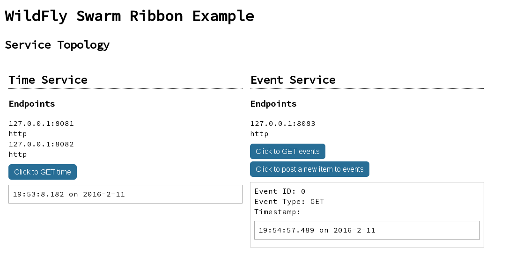
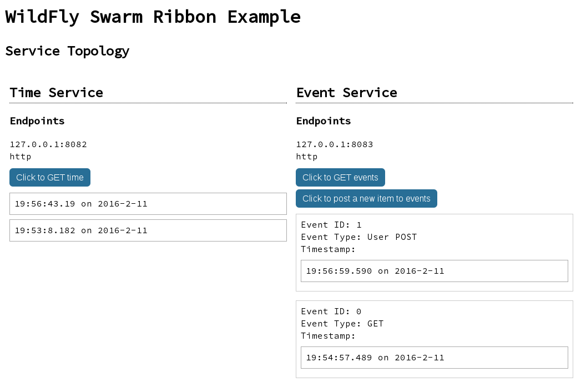
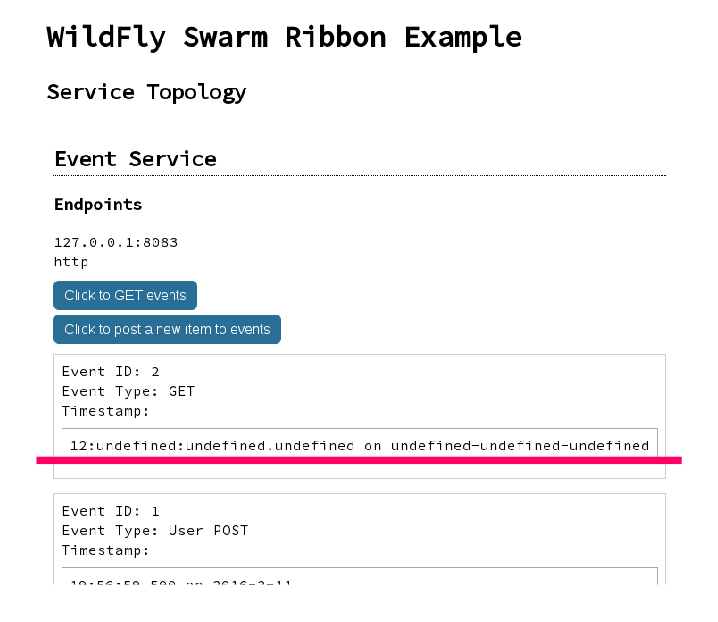
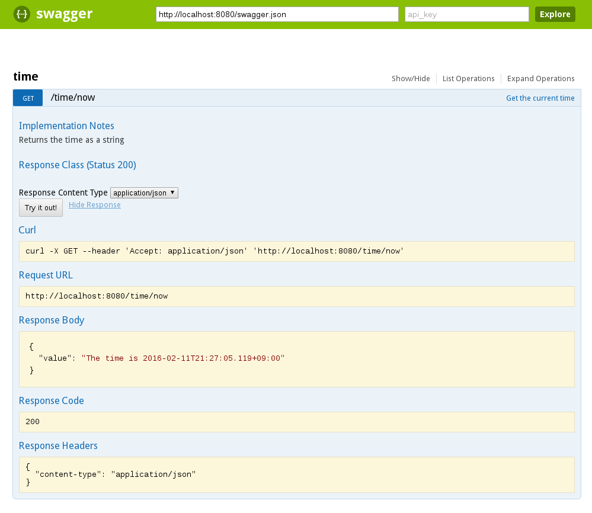

## WildFly Swarm In Progress

2016-02-13 第十四回 #渋谷java

<small>[@emaggame](https://twitter.com/emaggame)</small>
<small>,</small>
<small>http://morec.at</small>


## 目次

* WildFly
* WIldFly Swarm
* 基本的な使い方
* 便利な Fraction
* おまけ


http://wildfly.org/

* Java EE 7 準拠のアプリケーションサーバ
* 2016-01-29 10.0.0.Final がリリース


http://wildfly-swarm.io

* 公式キャッチフレーズ "Rightsize Your Services"
* Java EE で uber jar
 * Spring Boot のようなもの
 * Fraction という単位で必要な機能のみをもったアプリケーションを作成
 * 最新版 1.0.0.Alpha8。ベースは WildFly 10.0.0.Final


## 基本的な使い方

uberjar(`*-swarm.jar`) を作成するプラグイン

``` xml
<plugin>
  <groupId>org.wildfly.swarm</groupId>
  <artifactId>wildfly-swarm-plugin</artifactId>
  <configuration>
    <mainClass>wildflyswarmtour.App</mainClass>
  </configuration>
  <executions>
    <execution>
      <goals><goal>package</goal></goals>
    </execution>
  </executions>
</plugin>
```


## 基本的な使い方

好きな API を依存性に追加

``` xml
<dependency>
  <groupId>org.wildfly.swarm</groupId>
  <artifactId>jaxrs</artifactId>
</dependency>
```


## 基本的な使い方

アプリケーションを書く

普通の JAX-RS を利用したリソースクラス

``` java
import javax.ws.rs.GET;
import javax.ws.rs.Path;

@Path("/hello")
public class HelloWildFlySwarm {

  @GET
  public String hello() {
    return "Hello, WildFly Swarm!";
  }

}
```


## 基本的な使い方

アプリケーションのエンドポイントを作成

``` java
import org.jboss.shrinkwrap.api.ShrinkWrap;
import org.wildfly.swarm.container.Container;
import org.wildfly.swarm.jaxrs.JAXRSArchive;

public class App {
  public static void main(String[] args) throws Exception {
    Container container = new Container();

    JAXRSArchive deployment =
      ShrinkWrap.create(JAXRSArchive.class);
    deployment.addPackages(true, App.class.getPackage());
    deployment.addAllDependencies();

    container.start().deploy(deployment);
  }
}
```


## 基本的な使い方

あとはパッケージングすれば uber jar のできあがり。

``` sh
$ mvn clean package && java -jar target/hello-swarm.jar
19:10:43,529 INFO  [org.jboss.msc] (main) JBoss MSC version 1.2.6.Final
19:10:43,692 INFO  [org.jboss.as] (MSC service thread 1-6) WFLYSRV0049: WildFly Core 2.0.10.Final "Kenny" starting
2016-02-11 19:10:44,407 INFO  [org.jboss.as.naming] (ServerService Thread Pool -- 12) WFLYNAM0001: Activating Naming Subsystem
[...]
```

``` sh
$ curl localhost:8080/hello
Hello, WildFly Swarm!
```


## 基本的な使い方

その他に以下の方法でも起動可能

* mvn wildfly-swarm:run
* IDE から main() メソッド実行

Gradle を使いたい場合は以下を参考に。

https://github.com/wildfly-swarm/wildfly-swarm-examples/tree/1.0.0.Alpha8/gradle


## 便利な Fraction

* Netflix OSS
* Keycloak
* Swagger
* ...


### Netflix OSS


https://github.com/Netflix

Microservices の雄、Netflix は様々なライブラリを公開


### Netflix OSS

WildFly Swarm では Ribbon と Hystrix および依存ライブラリがすぐ使える。

``` xml
<dependency>
  <groupId>org.wildfly.swarm</groupId>
  <artifactId>ribbon</artifactId>
</dependency>
```

https://wildfly-swarm.gitbooks.io/wildfly-swarm-users-guide/content/netflixoss.html


### Netflix OSS

Ribbon と Hystrix の主な機能

* Ribbon: クライアントサイド ロードバランシング
* Hystrix: サーキットブレーカ


### Netflix OSS

* Time Service と Event Service の 2 サービスがある例
 * https://github.com/wildfly-swarm/wildfly-swarm-examples/tree/1.0.0.Alpha8/ribbon




### Netflix OSS

* Time Service は冗長化(ポート 8081 と 8082)
* Event Service は時刻表示に Time Service に依存




### Netflix OSS

Time Service は 8081 がダウンしても実行可能




### Netflix OSS

Time Service 両系ダウンすると Event Service は時刻表示にフォールバック用のレスポンス(次ページ)を利用




### Netflix OSS

``` java
import com.netflix.hystrix.HystrixInvokableInfo;
import com.netflix.ribbon.hystrix.FallbackHandler;
import io.netty.buffer.ByteBuf;
import rx.Observable;
import java.util.Map;

public class TimeFallbackHandler
            implements FallbackHandler<ByteBuf> {
    @Override
    public Observable<ByteBuf> getFallback(
              HystrixInvokableInfo<?> hystrixInfo,
              Map<String, Object> requestProps) {
        String fallback = "{ \"h\": 12 }";
        return ...
    }
}
```


### Keycloak


http://keycloak.jboss.org/

様々な認証形式に対応した認証・認可サーバ


### Keycloak

WildFly Swarm では Keycloak クライアントがリソース制限を設定する API を用意

``` java
deployment.as(Secured.class)
  .protect( "/some-resource" )
    .withMethod( "GET" )
    .withRoles( "admin" );
```

``` xml
<dependency>
  <groupId>org.wildfly.swarm</groupId>
  <artifactId>keycloak</artifactId>
</dependency>
```

https://wildfly-swarm.gitbooks.io/wildfly-swarm-users-guide/content/keycloak.html


### Keycloak

Keycloak サーバを WildFly Swarm を用いた<br/>
uber jar にすることも可能

* 自分でいろいろ設定したい場合
 * https://wildfly-swarm.gitbooks.io/wildfly-swarm-users-guide/content/keycloak_server.html
* ビルド済みのものを利用したい場合
 * https://wildfly-swarm.gitbooks.io/wildfly-swarm-users-guide/content/servers.html#_keycloak_server


### Swagger


http://swagger.io/

* REST API を定義する仕様を定めるライブラリ
* 2016-01-01 Open API と改名


### Swagger

WildFly Swarm では JAX-RS を用いた REST API に対して、<br/>
Swagger の定める REST API 仕様の表現である<br/>
swagger.json を出力する機能を用意

``` xml
<dependency>
  <groupId>org.wildfly.swarm</groupId>
  <artifactId>swagger</artifactId>
</dependency>
```

* https://wildfly-swarm.gitbooks.io/wildfly-swarm-users-guide/content/swagger.html
* http://wildfly-swarm.io/posts/wildfly-swarm-s-got-swagger/


### Swagger

* 現在時刻をレスポンスする API の例
 * https://github.com/wildfly-swarm/wildfly-swarm-examples/tree/1.0.0.Alpha8/jaxrs/swagger


### Swagger

``` java
import io.swagger.annotations.*;

@Path("/time")
@Api(value = "/time", description = "Get the time", tags = "time")
public class TimeResource {
  @GET
  @Path("/now")
  @ApiOperation(value = "Get the current time",
    notes = "Returns the time as a string",
    response = String.class
  )
  @Produces(MediaType.APPLICATION_JSON)
  public String get() {
    return String.format("{\"value\" : \"The time is %s\"}", ...);
  }
}
```

``` sh
$ curl localhost:8080/time/now
{"value" : "The time is 2016-02-13T14:00:00.000+09:00"}
```


### Swagger

``` sh
$ curl localhost:8080/swagger.json
```

``` json
{
  "paths": {
    "/time/now": {
      "get": {
        "responses": { "200": {
            "schema": { "type": "string" },
            "description": "successful operation"
          }
        },
```


### Swagger

``` sh
$ curl localhost:8080/swagger.json
```

``` json
"produces": [
  "application/json"
],
"operationId": "get",
"description": "Returns the time as a string",
"summary": "Get the current time",
"tags": [
  "time"
]
```


### Swagger

ドキュメンテーション UI である [Swagger UI](http://swagger.io/swagger-ui/) も WildFly Swarm で動かせる。

https://wildfly-swarm.gitbooks.io/wildfly-swarm-users-guide/content/servers.html#_swagger_ui_server

ビルド済みの jar をダウンロードして実行

``` sh
$ wget --trust-server-names http://bit.ly/swagger-ui-100Alpha8-swarm
$ java -jar swagger-ui-1.0.0.Alpha8-swarm.jar
```


### Swagger




### Swagger

現在の 1.0.0.Alpha8 の注意点として、<br/>
CDI を利用すると実行時エラーになる

* AmbiguousResolutionException thrown with swagger fraction
 * https://issues.jboss.org/browse/SWARM-271


## おまけ

WildFly Swarm を一通り触ってみるブログエントリ

__WildFly Swarm 周遊__

http://morec.at/blog/2015/12/21/wildfly-swarm-tour

* Hello WildFly Swarm
* 簡単な CRUD アプリ
* Arquillian を使った Integration Test
* Keycloak による認証
* Docker イメージ作成


## 最後に

WildFly Swarm は Java EE アプリケーションが手軽に作成できるだけでなく、様々な API のインテグレーションにも注力しています。

ぜひ触っていただいて応援やコミュニティに参加いただくとともに、機能追加やバグ指摘などお願いします。

* Community
 * http://wildfly-swarm.io/community/
* JIRA
 * https://issues.jboss.org/secure/RapidBoard.jspa?rapidView=2972
